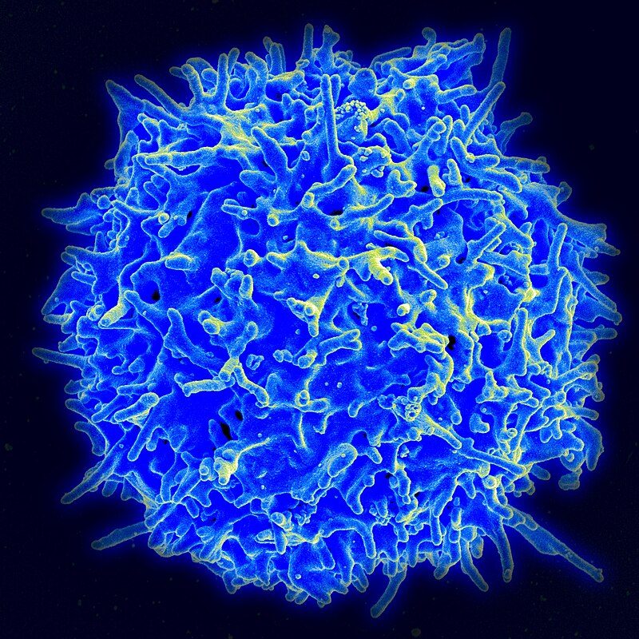

# Projects

## Tumor Immune Evasion

Collaboration with Nick Giacobbi in Dohun Pyeon's lab that investigates the mechanisms by which tumors evade the immune system, epigenetic downregulation of MHC-I. The aim is to improve therapeutic strategies to enhance anti-tumor immunity.

[Read more about this project](tumor-immune-evasion.html)

